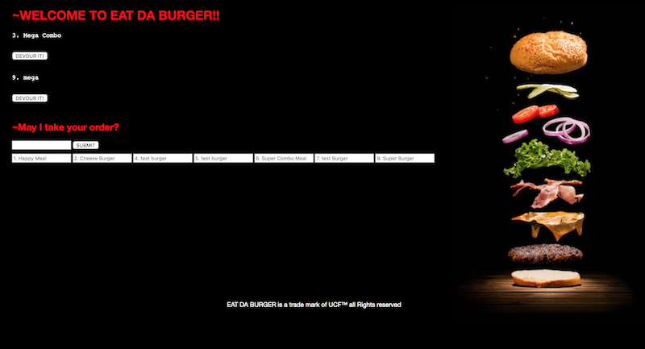
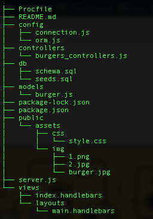

## Test the Burger App

https://newburger2.herokuapp.com/

## What the Project looks like

## Aditional Information

- This Project display a list of food already made, The user can either eat whats already made or ask to make somthing new. The user then eats the food and it will display whatever the user ate on another container.

## This Project was built using:
- HTML / Handlebars
- CSS
- Javascript
- Express
- Body Parser
- Method override
- DataBase: Mysql.
- Deploy: Heroku.

## How to Run this Project Localy
- Clone / Download the repository.
- Unzip the file.
- Drag and drop the unzip folder on a text editor of your choice.
- Cd to the directory
- In the command line do "npm install" wait...

- Now you need to have a little understanding of Database. In this case we are using Mysql.
- Download "MysqlWorkbench" and also "Mamp"
- Open Mamp and click "Start Servers"
- Open MysqlWorkbench > look for MySQL Connections and click the "+" button.
- Where its says Connection Name, type "burgers_db" and click ok.
- Assuming you never used MysqlWorkbench, you will only see one DB which is the one you just created named "burgers_db".
- Click the DB, if your promped for a password by default its "root". Hit ok.
- Go back to the text editor and look for the folder call DB > click on it. There is two files there "schema.sql" & "seeds.sql"
- Click on schema.sql > copy everything and paste it on MysqlWorkbench 
- Look for a lighting button ( there is two lighting button, click the one wihtout the "I".
- By now, if everything went smoothly you should see some green circles somewhere.
- All that means is the DB and table were created.
- On the left conner you should see the DB, click on the arrow. You should see tables, click the arrow next to it.
- Now you will see burgers - right click on it, and a bunch of options should display, click on select rows(new tap should open on MysqlWorkbench)
- Go back to the text editor and click on the seeds.sql file. copy evething and past it on the new tab on MysqlWorkbench.
- Now click the lighting button again.
- Now on your  command line type "node server.js"
- Your default browser should open and load the Project automatically.
- If not, just open the browser and type "http://localhost:3000/"

## Folder Structure

## Future Improvements
- Convert the project to React.
